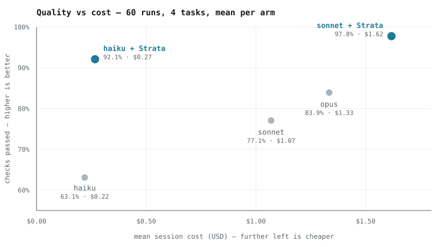

<div align="center">


### Your agent writes the backend. Strata proves it runs.

An MCP server that composes verified backend modules into your codebase — reading your schema,
following your conventions, wiring them in the order Express actually requires — then writes one
command that boots the app and exercises every requirement against a live server.

<br>

[](https://www.npmjs.com/package/stratalib)
[](https://nodejs.org)
[](https://modelcontextprotocol.io)
[](LICENSE)
[](https://stratalib.com)
[](https://x.com/stratalib)

[](docs/BENCHMARK.md)
[](docs/BENCHMARK.md)
[](docs/BENCHMARK.md)
[](#admission-gates)

</div>

<br>

```console
$ # your agent calls one tool, once
  strata_use  dir=./shop-api  task="product list API"
              capabilities=[ "cursor pagination with sorting",
                             "per-IP rate limiting",
                             "structured request logging" ]

  FILES CREATED
    server.js
    strata/lib.js       — the implementation these import from
    strata/verify.js    — boots the app and exercises the feature end to end

$ npm install && node strata/verify.js

  PASS  unit selftests — 3 passed, 0 failed
  PASS  server boots and answers /health
  PASS  correlation id honours an inbound x-request-id
  PASS  an authorization header is NOT written to the log
  PASS  a password in a request BODY is NOT written to the log
  PASS  a malformed body is a 4xx and leaks no stack trace to the caller
  PASS  /items walks pages by cursor without repeating a row
  PASS  a sort field that is not allowlisted is REJECTED, not honoured
  PASS  a burst past capacity yields 429 + Retry-After

  12/12 checks passed — the delivered feature works end to end.
```

<div align="center">
<sub>Real output. Those check names are the whole idea — anyone can generate pagination,<br>
the question is whether page two repeats page one.</sub>
</div>

---

**Key capabilities**

- **Schema-aware composition** — reads Prisma, Mongoose, Drizzle, TypeORM, Sequelize or plain JS and wires modules against your real entity, fields and ID column
- **Correct middleware ordering** — logging above body parsing, rate limits above routes, error handlers last, enforced by rank rather than left to the model
- **Generated end-to-end verifier** — `strata/verify.js` boots the app on a free port and drives every requirement against it
- **Six machine-checked admission gates** — no module reaches your project without passing all of them
- **Honest declines** — refuses roughly a third of tasks, where composing costs more than writing the code

<br>

```console
$ # asked for something the library does not cover
  strata_use  task="slugify helper"  capabilities=["convert a string to a url slug"]

  No verified Strata recall covers "slugify helper". Build it from scratch the
  normal way — a clean hand-written implementation is the right outcome here,
  not a forced match.
```

<div align="center">
<sub>Refusing is a feature. One module is not worth the cost of reading and verifying it,<br>
and a tool that always says yes is a tool you stop trusting.</sub>
</div>

- **Local by construction** — your source and schema never leave the machine; only the task text is sent

---

## Benchmark

<div align="center">
  <picture>
    <source media="(prefers-color-scheme: dark)" srcset="docs/assets/benchmark-dark.svg">
    
  </picture>
</div>

60 full agent sessions: four backend tasks, five arms, three runs each. Checks were frozen and published before the first run, every check carries a negative control proving it can fail, and every output tree is archived. Delivered module source is not published — modules live in the hub and reach a project at call time.

### Did it work the first time?

| Arm | Worked first try | Wall time | Cost / run | Cost of one working feature |
|---|---|---|---|---|
| haiku | **0 / 11** — 0% | 5.1 min | $0.22 | **never produced one** |
| **haiku + Strata** | **6 / 12** — 50% | **3.6 min** | $0.27 | **$0.53** |
| sonnet | 2 / 11 — 18% | 4.4 min | $1.07 | $5.88 |
| **sonnet + Strata** | **10 / 12** — 83% | 6.1 min | $1.62 | **$1.94** |
| opus | 3 / 12 — 25% | 5.2 min | $1.33 | $5.33 |

"Worked first try" = every pre-registered check for that task passed, with no second attempt. Plain haiku is the cheapest per run and produced nothing that fully worked in eleven attempts.

### Share of checks passed

| Arm | Catalog | Idempotency | Payments | Retry | Average |
|---|---|---|---|---|---|
| haiku | 70.8% | 66.7% | 29.2% | 85.7% | **63.1%** |
| **haiku + Strata** | 87.5% | 85.7% | 100% | 95.2% | **92.1%** |
| sonnet | 62.5% | 85.7% | 95.8% | 64.3% | **77.1%** |
| **sonnet + Strata** | 100% | 100% | 95.8% | 95.2% | **97.8%** |
| opus | 75.0% | 90.5% | 75.0% | 95.2% | **83.9%** |

**Two checks were failed by every baseline run at every tier and passed by every Strata run** — a rate limiter whose window never refills (baseline 0/9, Strata 6/6) and a malformed request that returns a stack trace to the caller (0/9, 6/6). haiku 0/3, sonnet 0/3, opus 0/3 on both. A larger model fixed neither.

### What it costs you

**Strata is a cost premium per session** — +26% on haiku, +51% on sonnet. That premium is caused by reading, not writing: two thirds to four fifths of an agent bill is re-reading accumulated context, and a Strata session reads ~12–14k tokens of delivered implementation where a baseline reads ~1k. Work is underway to close it; it is not closed today.

**Roughly three quarters of the advantage is in defects you would not have noticed** — edge cases, timing, and correctness bugs that surface later as incidents. On defects you *would* notice, a plain model is already right 86.4% of the time. That is why `strata/verify.js` exists: it turns correctness into a list of named checks you can read.

Full methodology, per-run scores, the visible/invisible split and every instrument defect found along the way: [`docs/BENCHMARK.md`](docs/BENCHMARK.md).

---

## Quick start

**Prerequisites:** Node.js ≥ 18 and any MCP client — Claude Code, Cursor, Windsurf, VS Code or Claude Desktop.

```jsonc
// .mcp.json  (or claude_desktop_config.json for Claude Desktop)
{
  "mcpServers": {
    "strata": { "command": "npx", "args": ["-y", "stratalib"] }
  }
}
```

Restart the client and ask for a backend feature that needs several parts:

```
Add cursor pagination, per-IP rate limiting and request logging to the products API.
```

Strata reads the project, composes the modules, writes the files, and prints what it created and what it modified. Then:

```bash
npm install && node strata/verify.js
```

> [!NOTE]
> No API key and no account. Modules are served from the hub; the task text is the only thing sent. Your source, schema and files stay on your machine.

---

## The tool

Strata registers exactly one tool. Every tool in an MCP schema is billed on every turn, so the surface is kept to one that does the whole job.

**`strata_use`**

| Argument | Purpose |
|---|---|
| `dir` | Absolute path to the project root — where the schema and conventions are read from |
| `task` | A short label for the work |
| `capabilities` | 3–6 phrases naming the parts of the job. Your model writes these; it has read the whole task |

Returns the files created and modified, the exports available from each module, and the command to verify the result.

---

## How it works

**1 · Reads the project** — locates the ORM and extracts the real entity: fields, types, enums and the actual ID column. Deterministic, in Node, before the model sees a byte. Where the entity cannot be identified with confidence, Strata leaves a slot rather than guessing.

**2 · Selects modules** — each capability phrase is scored against the library, and anything matching on shared vocabulary alone is discarded. Fewer than two surviving modules triggers a decline.

**3 · Composes** — modules contribute to the app rather than owning it, each contribution carrying a rank that fixes its position in the middleware chain. A malformed request throws during body parsing, so logging mounts above it; get that backwards and the one request most worth tracing is the one that loses its correlation id.

**4 · Writes the verifier** — `strata/verify.js` runs each module's own suite, boots the app on a free port, and exercises every requirement against it. Built against your entity, so the checks run on your fields and your routes.

---

## Admission gates

Every module passes six machine-checked gates before it can be served. A module that fails is discarded, not repaired — hand-patching generated modules returns coverage to craft and stops it scaling.

| Gate | Requirement |
|---|---|
| Exports | Loads, and every export it declares resolves at runtime |
| Selftest | Its own suite passes, with a stable assertion count across five runs |
| Adversarial | ≥ 8 assertions, hostile inputs, and assertions that something must **not** happen |
| Compose | Valid fragments with ranks, and declared factories that exist |
| Collisions | No exported name collides with another module |
| Composed boot | Composes with two others into an app that starts and verifies |

The adversarial gate is the one that matters. Every hand-written module in this library shipped with a real bug its own tests did not catch — a 404 that reset a circuit breaker's failure count, a dropped enum constraint, an attacker-controlled request id echoed into a response header. A confirmatory suite admits exactly those.

---

## Repository layout

| Path | Contents |
|---|---|
| `src/` | MCP server: project reading, selection, composition, verifier generation |
| `bin/` | CLI entry point |
| `templates/` | Express skeleton used during composition |
| `benchmark/` | The 60-run quality battery, pre-registered suites, negative controls, archived output trees |
| `scripts/` | Admission gates, library indexing, selection tests |

Modules are served from the hub; the task text is the only thing sent. Your source, schema and files stay on your machine.
## Documentation

| Document | Subject |
|---|---|
| [`docs/BENCHMARK.md`](docs/BENCHMARK.md) | The 60-run benchmark: method, board, and every instrument defect found |

---

## Development

```bash
npm install
node --max-old-space-size=8192 node_modules/typescript/bin/tsc -p tsconfig.mcp.json   # build
node scripts/admit-recall.js recalls/<domain>/<name>/v1                                # run the gates
node benchmark/quality/negative-control.js                                             # prove the checks can fail
node benchmark/run-quality-battery.js --tasks catalog --max 3                           # collect runs
```

`STRATA_MODE=local` composes against a local `recalls/` checkout instead of the hub — required when testing a module that has not been deployed.

---

## Acknowledgements

Built on the Model Context Protocol, Express, Prisma, Mongoose, Drizzle, TypeORM and Sequelize.

## License

AGPL-3.0-or-later. See [`LICENSE`](LICENSE).

---

<div align="center">
<sub>
<a href="https://stratalib.com">stratalib.com</a> · <a href="https://www.npmjs.com/package/stratalib">npm</a> · <a href="https://x.com/stratalib">@stratalib</a>
</sub>
</div>

