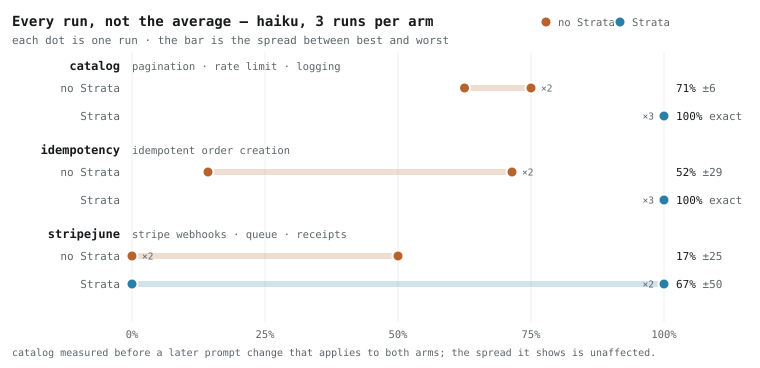

# Benchmark

Four backend tasks, five arms, three runs each. 60 full agent sessions measured end to end — cost is
the whole session bill, not a token count from a single call.

---

## v1.1 — the number that survives scrutiny

<picture>
  <source media="(prefers-color-scheme: dark)" srcset="assets/consistency-dark.svg">
  
</picture>

Run one task three times with one model and the interesting question is not *"was it good"* but
**"was it the same"**.

| task | without Strata | **with Strata** |
|---|---|---|
| catalog | 63%, 75%, 75% | **100%, 100%, 100%** |
| idempotency | **14%**, 71%, 71% | **86%, 86%, 86%** |
| stripejune | 0%, 0%, 50% | 0%, 100%, 100% |

On the two tasks the library covers well, **every Strata run of a task returns the identical score** —
a standard deviation of 0.0 against baseline's 26.9 points on idempotency. Strata does not beat the
ceiling; a good baseline run reaches the same 86%. It reaches it *every time*.

The idempotency 14% is stable across repeat gradings, not a grading artefact. That session invented an
order API whose create endpoint rejected all five request shapes the grader tried, and because every
other property depends on creating an order, five checks became undemonstrable at once. **A cliff, not
a slightly worse result** — and nothing in the session's own output says it happened.

### Where it does not hold

**stripejune is published with its failures intact.** Both arms produce a build that does not run:
baseline never wrote an entry point in one run, and Strata shipped `bullmq@5.81.3` pinned beside
`redis@4.7.1` in another, which cannot `npm install`. Both packages are model-chosen — Strata covers
the webhook and nothing else on that task.

That is the rule the whole board obeys: **Strata's advantage tracks how much of the task its library
actually covers.** Four capabilities asked for, one covered, and the cost ratio lands at 0.95× — a wash.

### Cost, on a matched instrument

| task | | turns | cost | quality |
|---|---|---|---|---|
| catalog | baseline | 31.3 | $0.190 | 70.8% |
| | **Strata** | **15.0** | **$0.077** | **100%** |
| idempotency | baseline | 27.7 | $0.175 | 52.4% |
| | **Strata** | **21.7** | **$0.134** | **85.7%** |
| stripejune | baseline | 48.7 | $0.406 | 16.7% |
| | **Strata** | **43.7** | **$0.385** | **66.7%** |

Cost is the least stable number here — it moves with the model, the prompt and the machine, and every
figure above needs its caveats. The consistency figures need none.

`n=3`, Claude Haiku 4.5, one model per cell. Nothing here speaks to Sonnet or Opus.

---

## The original 60-run battery

Everything below is the earlier five-arm battery on a different prompt instrument. Its numbers are not
averaged with the v1.1 cells above, and never should be.

## Method

**Pre-registered.** Every check was written from the task prompt alone and committed before the first
run of that task. The suite file and the code that runs it are hashed together and the hash is recorded
on every result, so scores produced by different instruments are never averaged.

**Negative controls.** Each check has a matching mutation that breaks the property it tests, and the
control asserts the check goes red. A check that cannot fail is not a check. All 23 discriminate.

**Graded independently.** `strata/verify.js` is generated by Strata, so it is never the grader — that
would be marking its own homework. Grading is a separate suite that knows nothing about which modules
were delivered.

**Reproducible, with one stated limit.** Every output tree is archived, so the code each session wrote
is published — the app, its wiring, and the generated verifier. The delivered **module source is not**:
modules live in the hub and are delivered to a project at call time, and the library is not shipped.
Baseline arms use no modules, so those trees are complete and re-gradable as they stand. For Strata
arms the app-level code and the verifier are published, but re-grading them end to end requires the
modules, which means running Strata.

```bash
node benchmark/quality/negative-control.js   # prove the checks can fail
node benchmark/quality/grade.js --all        # re-grade every archived tree
```

## Arms

Cross-model by design: the claim under test is that a cheap model with Strata reaches the quality of an
expensive model without it, so the comparison has to cross tiers.

| Arm | Role |
|---|---|
| haiku | the floor — what the cheap model does alone |
| haiku + Strata | the product |
| sonnet | the quality target to match |
| sonnet + Strata | whether the lift replicates one tier up |
| opus | the ceiling — is there any tier that fixes these checks |

## Tasks

| Task | Prompt | Shape |
|---|---|---|
| Catalog | pagination, per-IP rate limiting, traceable request logging | brownfield |
| Idempotency | retry-safe order creation, body validation, attempt logging | brownfield |
| Payments | Stripe webhooks with signature verification, email confirmation, queued PDF receipt | greenfield |
| Retry | a helper that calls a flaky API and retries with backoff | greenfield |

Retry is the control. One small helper sits far below the point where composing and verifying delivered
code costs less than writing it, and it was included expecting a loss.

## Results

| Arm | Catalog | Idempotency | Payments | Retry | Average | Cost |
|---|---|---|---|---|---|---|
| haiku | 70.8% | 66.7% | 29.2% | 85.7% | **63.1%** | $0.22 |
| **haiku + Strata** | 87.5% | 85.7% | 100.0% | 95.2% | **92.1%** | $0.27 |
| sonnet | 62.5% | 85.7% | 95.8% | 64.3% | **77.1%** | $1.07 |
| **sonnet + Strata** | 100.0% | 100.0% | 95.8% | 95.2% | **97.8%** | $1.62 |
| opus | 75.0% | 90.5% | 75.0% | 95.2% | **83.9%** | $1.33 |

Quality is the share of pre-registered checks passed. Cost is the mean session bill.

## Outcome

The board above answers "what share of checks passed". That is the right question for a method and
the wrong one for a reader deciding whether to install something. The same runs, asked the question
a user actually has:

| Arm | Worked first try | Wall time | Cost / run | Cost of one working feature |
|---|---|---|---|---|
| haiku | **0 / 11** — 0% | 5.1 min | $0.22 | **never produced one** |
| **haiku + Strata** | **6 / 12** — 50% | **3.6 min** | $0.27 | **$0.53** |
| sonnet | 2 / 11 — 18% | 4.4 min | $1.07 | $5.88 |
| **sonnet + Strata** | **10 / 12** — 83% | 6.1 min | $1.62 | **$1.94** |
| opus | 3 / 12 — 25% | 5.2 min | $1.33 | $5.33 |

"Worked first try" means every pre-registered check for that task passed on that run, with no second
attempt. "Cost of one working feature" is the cost per run divided by the share of runs that fully
worked — the expected spend to obtain one.

Two runs are ungraded (`retry-baseline-haiku-1`, `retry-baseline-sonnet-1`): they delivered
TypeScript the probe could not drive, and are recorded as unmeasured rather than as zeros, which is
why some denominators are 11 rather than 12.

Plain haiku is the cheapest per run and produced nothing that fully worked in eleven attempts. That
is the case for measuring outcomes rather than attempts: a failed run is not a discount. In this
battery failed runs were not even cheap — a haiku baseline cost $0.17 when the app booted and $0.38
when it did not, because the model burns turns flailing.

## Where the advantage lives

Not every defect is one a developer would notice. Grouping the checks by how a defect would surface
to the person who asked for the feature:

| Class | Would they notice? | baseline | with Strata | gain |
|---|---|---|---|---|
| obvious — wrong answer to an ordinary request | likely | 86.4% | 93.8% | **+7.4 pts** |
| edge — needs malformed or hostile input | rarely | 66.7% | 87.5% | +20.8 pts |
| load — needs traffic, timing or concurrency | rarely | 70.7% | 96.3% | +25.6 pts |
| silent — surfaces later as an incident | never | 70.9% | 98.1% | **+27.3 pts** |

**About three quarters of the advantage is in defects the requester could not have noticed.** On the
defects they would notice, a plain model is already right 86.4% of the time.

This is the honest shape of the result, and it cuts both ways. It means "it looks fine" is a
reasonable report from someone running a plain model — for what they can see, it mostly is. It also
means the value is invisible without something that makes it visible, which is what
`strata/verify.js` is for: it turns correctness into a list of named checks and a number.

The classification is a judgement call, published so it can be argued with:
`benchmark/quality/analyze-visibility.js`.

### What holds

- A cheap model with Strata scores above a frontier model without it, at a fifth of the cost.
- `sonnet + Strata` is the only arm to reach a perfect score, and reaches it twice. No baseline at any
  tier reached one in thirty-six attempts.
- Quality does not track price across baselines: sonnet is the weakest arm on catalog while costing
  6.6× the cheapest, and opus loses to haiku + Strata on three of four tasks.
- Strata's spread is tighter. Where baselines swing within a single cell, the Strata cells repeat.
- **Two checks were failed by every baseline run at every tier, and passed by every Strata run.** A
  rate limiter whose window never refills (baseline 0/9, Strata 6/6) and a malformed request that
  returns a stack trace to the caller (0/9, 6/6). haiku 0/3, sonnet 0/3, opus 0/3 on both. Paying for
  a larger model fixed neither.

### What does not

- **Cost is a premium on three of four tasks** — +73% on catalog, +22% on idempotency, +74% on sonnet's
  payments run. The trade is quality and predictability, not spend.
- **The premium is caused by reading, not by writing.** Two thirds to four fifths of an agent bill is
  cache-read — re-reading the accumulated conversation on every turn. Strata sessions read ~12–14k
  tokens of delivered implementation into context against a baseline's ~1k, and they read it early,
  where it is re-billed on every remaining turn. Measured as re-billed token-turns that is 10.4× the
  baseline on haiku and 21.6× on sonnet. Meanwhile Strata halves the number of files the model writes
  and barely moves output tokens at all, because model output is mostly reasoning rather than code.
  Reproduce with `benchmark/quality/analyze-cost.js` and `analyze-reads.js`.
- **The payments task is half covered.** Strata has a verified Stripe webhook module but no queue or PDF
  module, so the model hand-writes those in both arms while Strata still charges its overhead.
- **On payments the effect inverts with model strength.** Given the same modules, haiku's session length
  is unchanged (48 → 49 turns) while sonnet's grows 28% (64 → 82) as it re-reads and reworks code it did
  not write. The stronger the model, the less delivered code is worth to it in a high-stakes domain.
- **Retry's quality comparison is weaker evidence than the other three.** Two baseline runs delivered
  TypeScript the probe could not drive, and no Strata run did — Strata ships CommonJS and the model
  follows the delivery. An exclusion that only ever lands on one arm is how a benchmark manufactures its
  own result. The cost comparison is unaffected.

## Per task

### Catalog — 8 checks

| Arm | Scores | Quality | Cost | Turns |
|---|---|---|---|---|
| haiku | 5/8 6/8 6/8 | 70.8% | $0.13 | 24 |
| haiku + Strata | 8/8 6/8 7/8 | 87.5% | $0.22 | 32 |
| sonnet | 5/8 5/8 5/8 | 62.5% | $0.84 | 38 |
| sonnet + Strata | 8/8 8/8 8/8 | 100.0% | $1.15 | 43 |
| opus | 6/8 6/8 6/8 | 75.0% | $1.18 | 32 |

### Idempotency — 7 checks

| Arm | Scores | Quality | Cost | Turns |
|---|---|---|---|---|
| haiku | 5/7 4/7 5/7 | 66.7% | $0.22 | 33 |
| haiku + Strata | 6/7 6/7 6/7 | 85.7% | $0.27 | 36 |
| sonnet | 6/7 6/7 6/7 | 85.7% | $0.97 | 39 |
| sonnet + Strata | 7/7 7/7 7/7 | 100.0% | $1.36 | 47 |
| opus | 6/7 6/7 7/7 | 90.5% | $1.16 | 27 |

### Payments — 8 checks

| Arm | Scores | Quality | Cost | Turns |
|---|---|---|---|---|
| haiku | 7/8 0/8 0/8 | 29.2% | $0.36 | 48 |
| haiku + Strata | 8/8 8/8 8/8 | 100.0% | $0.42 | 49 |
| sonnet | 8/8 8/8 7/8 | 95.8% | $1.94 | 64 |
| sonnet + Strata | 8/8 7/8 8/8 | 95.8% | $3.37 | 82 |
| opus | 7/8 7/8 4/8 | 75.0% | $2.30 | 45 |

The two `0/8` haiku runs did not start. One writes an ESM main-module guard that is always false on
Windows, so `npm start` silently does nothing; the other crashes on a BullMQ misconfiguration. Both are
real defects — an app that does not boot fails every check — but they are startup bugs rather than
payment-security ones, and they are what drags that cell to 29.2%.

### Retry — 7 checks

| Arm | Scores | Quality | Cost | Turns |
|---|---|---|---|---|
| haiku | 6/7 6/7 | 85.7% | $0.17 | 18 |
| haiku + Strata | 7/7 7/7 6/7 | 95.2% | $0.15 | 15 |
| sonnet | 5/7 4/7 | 64.3% | $0.53 | 18 |
| sonnet + Strata | 6/7 7/7 7/7 | 95.2% | $0.60 | 20 |
| opus | 7/7 7/7 6/7 | 95.2% | $0.70 | 12 |

Three baseline runs are missing from the scores column: they delivered TypeScript the probe could not
drive and are recorded as unmeasured rather than as zeros. See the caveat above.

## Artifacts

| Path | Contents |
|---|---|
| `benchmark/runs/exp-quality/*.json` | one record per run — arm, model, turns, cost, modules delivered |
| `benchmark/runs/exp-quality/GRADES.json` | every check result, with the instrument hash |
| `benchmark/runs/exp-quality/trees/` | the code each session wrote — app, wiring and verifier. Delivered module source is excluded; it is not published. |
| `benchmark/quality/suites.js` | the pre-registered checks |
| `benchmark/quality/grade.js` | the grader |
| `benchmark/quality/negative-control.js` | the mutations proving each check can fail |
| `benchmark/quality/verify-board.js` | recomputes the published board from the raw grades |
| `benchmark/quality/outcome-board.js` | the outcome table above |
| `benchmark/quality/analyze-visibility.js` | the visible/invisible split |
| `benchmark/quality/verify-universal.js` | exact counts behind "every baseline failed this" |
| `benchmark/quality/analyze-cost.js` · `analyze-reads.js` | where the cost premium comes from |

One instrument note worth stating, since it would otherwise be invisible: `GRADES.json` keys 40 of
its 60 rows by run name and the other 20 by the original temp directory. Joining on run name alone
silently drops twenty runs, including the three most expensive sessions in the battery, and inflates
every Strata average. `verify-board.js` joins on both keys and reproduces the published board exactly;
any re-analysis should use it as the reference.

Raw session transcripts are not published. They record host paths and full agent conversations, and the
archived trees are the artifact the scores are actually computed from.
